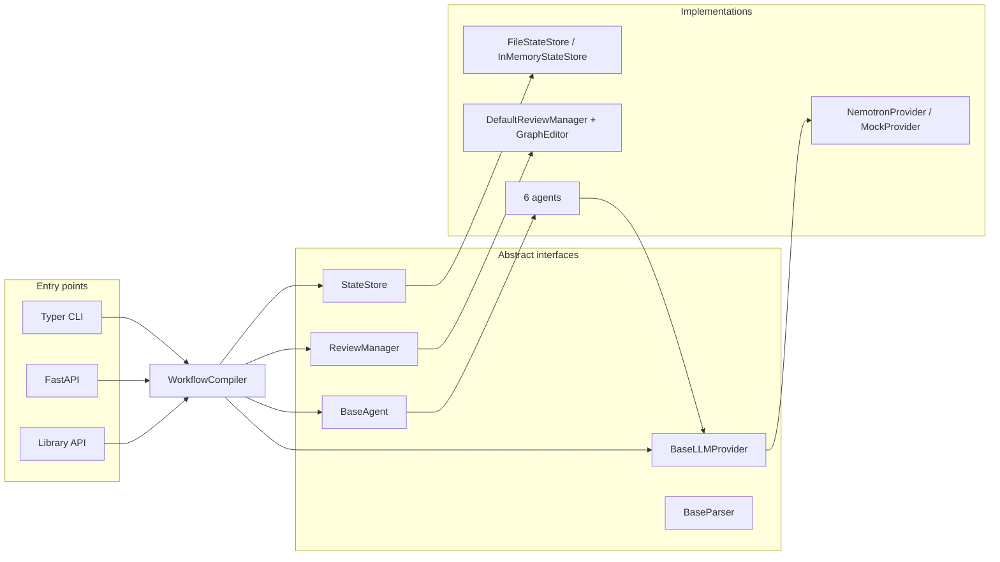
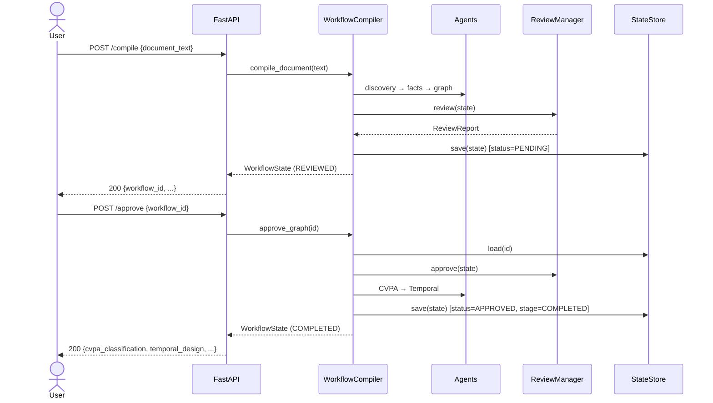

# Architecture

`workflow-compiler` turns a business document into canonical artifacts through a sequence of
single-responsibility **agents** orchestrated by `WorkflowCompiler`, with a human approval gate in
the middle. Every collaborator is defined by an abstract interface, so providers, parsers, the
review manager, and the state store are all swappable.

## Pipeline overview

```mermaid
flowchart TD
    doc["Business document<br/>(docx / pdf / md / html / txt)"]
    parser["DocumentParserFactory<br/>(ingestion)"]
    discovery["WorkflowDiscoveryAgent<br/>→ WorkflowMetadata"]
    facts["FactExtractionAgent<br/>→ WorkflowFacts + WorkflowStructure<br/>(flat facts + id-linked relations)"]
    graph["GraphBuilderAgent<br/>→ WorkflowGraph + Mermaid<br/>(deterministic, NetworkX)"]
    review["GraphReviewer / DefaultReviewManager<br/>→ ReviewReport"]
    gate{"Approval gate"}
    cvpa["CVPAClassifierAgent<br/>→ CVPAClassification"]
    temporal["TemporalGeneratorAgent<br/>→ TemporalWorkflowDesign"]
    codegen["TemporalCodeGeneratorAgent<br/>→ TemporalCodeBundle<br/>(deterministic, Jinja2)"]
    done(["COMPLETED"])
    halt(["REJECTED — pipeline halts"])

    doc --> parser --> discovery --> facts --> graph --> review --> gate
    gate -->|approve| cvpa --> temporal --> codegen --> done
    gate -->|reject| halt
```

LLM-backed stages: discovery, fact extraction, CVPA classification, Temporal design.
Deterministic (no LLM) stages: graph building, Mermaid rendering, structural review,
**Temporal code generation**.

## Relational fact extraction → semantic graph wiring

Fact extraction emits two layers: **flat facts** (`WorkflowFacts`) and an optional
**relational `WorkflowStructure`** — entities that each carry a stable id, with every relation
(decision→activity, exception→activity, compensation→activity, event→emitter, parallel groups)
expressed by *referencing those ids*. `WorkflowStructure.validated()` enforces **referential
integrity**: any relation pointing at an id that was never declared is dropped (the anti-hallucination
guard), and **state transitions whose endpoints are actually entity ids** (the model leaking the step
flow into the state graph) are discarded so they can't build a junk subgraph. When a structure is
present, `GraphBuilderAgent` wires the graph *semantically* via
`WorkflowGraphBuilder.build_from_structure` — placing each edge from its explicit link, and routing
any uncompensated exception to a terminal so it can't dangle — instead of the positional `build`
fallback (which pairs the i-th activity with the i-th decision/exception/compensation and is only
used for legacy flat-only facts). This is what stops the graph from mis-attributing decisions,
events, and compensations.

The Temporal stage is two steps. `TemporalGeneratorAgent` (LLM) emits a
specification-only `TemporalWorkflowDesign` — names, parameters, policies, no code.
The design has two layers: **declarations** (activities, signals, queries, child
workflows, timers, compensations) and a typed **plan IR** — an ordered
control-and-data-flow graph of `TemporalStep` "action categories" (activity / child /
signal-gate / timer / parallel / branch) whose inputs are explicitly bound to the
workflow input or earlier step outputs. The design stage is fed the extracted
`workflow_facts` (retries, timeouts, compensations, I/O), so policies are *derived from*
the document rather than guessed. `TemporalCodeGeneratorAgent` (deterministic) then walks
that plan to render a runnable `TemporalCodeBundle` of Temporal Python SDK source files —
threading data between activities, firing saga compensations in reverse on failure, and
gating on signals. The LLM never writes code; the code is a pure function of the reviewed,
approved design. See `TEMPORAL_CODEGEN_FINDINGS.md` for the standard it satisfies.

## Components



## Request sequence (compile → approve)



## State model

`WorkflowState` is the single aggregate threaded through the pipeline. Each stage populates one
field and advances `stage`:

| Stage                | Field populated          | Producer                  |
|----------------------|--------------------------|---------------------------|
| `METADATA_EXTRACTED` | `workflow_metadata`      | WorkflowDiscoveryAgent    |
| `FACTS_EXTRACTED`    | `workflow_facts`         | FactExtractionAgent       |
| `GRAPH_BUILT`        | `workflow_graph`, `mermaid_diagram` | GraphBuilderAgent |
| `REVIEWED`           | `review_report`          | DefaultReviewManager      |
| *(gate)*             | `approval_status`        | approve / reject          |
| `CLASSIFIED`         | `cvpa_classification`    | CVPAClassifierAgent       |
| `TEMPORAL_DESIGNED`  | `temporal_design`        | TemporalGeneratorAgent    |
| `CODE_GENERATED` → `COMPLETED` | `temporal_code` | TemporalCodeGeneratorAgent |

`confidence_scores` accumulates a per-stage score throughout.

## Design principles

- **Provider-agnostic LLM layer.** Agents depend only on `BaseLLMProvider`; the concrete provider
  is injected. No vendor SDK is imported.
- **Deterministic where it matters.** Graph construction and structural review are pure functions
  of the extracted facts — reproducible and testable without a model.
- **Validated, immutable edits.** `GraphEditor` returns new validated `WorkflowGraph` instances;
  invalid edits raise rather than corrupting state.
- **Human-in-the-loop gate.** Downstream (CVPA, Temporal) artifacts are produced only after
  approval, keeping generated designs traceable to a reviewed graph.
- **The LLM specifies; templates emit code.** The LLM-backed Temporal stage emits
  specifications only (names, parameters, policies) — never executable code. Runnable Temporal
  Python SDK code is produced separately by a *deterministic* generator
  (`codegen/temporal`, Jinja2 templates) that renders the approved `TemporalWorkflowDesign`.
  Generated code is therefore a reproducible function of a reviewed design, and the no-code
  guarantee on the design model still holds.
