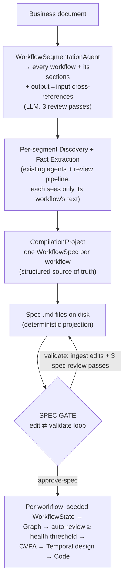
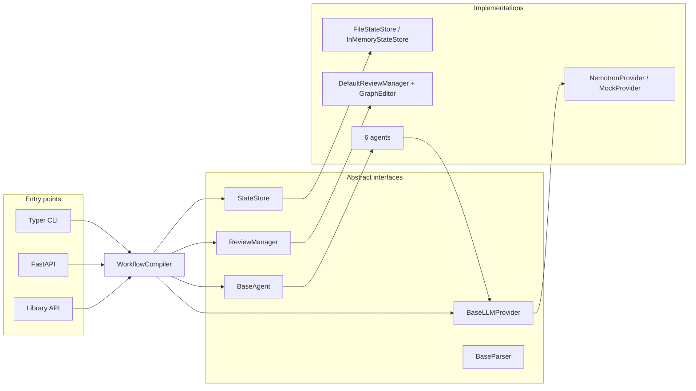
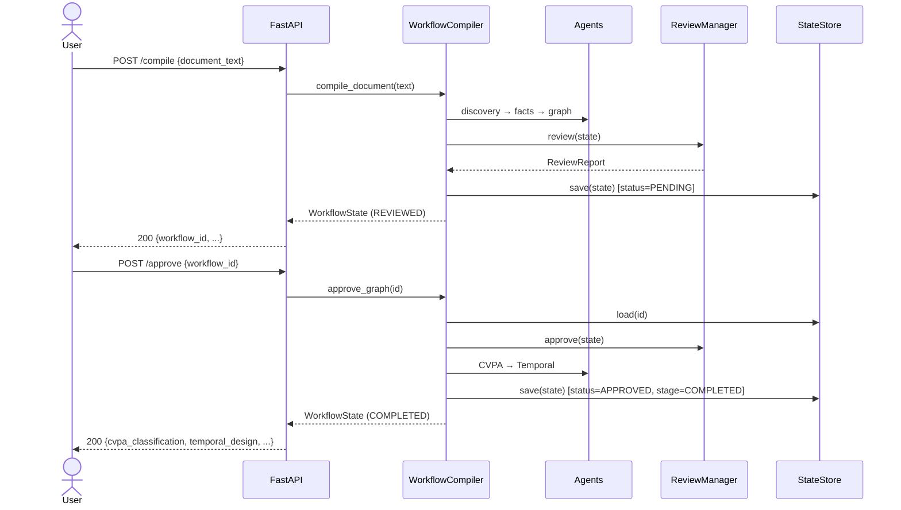

# Architecture

`workflow-compiler` turns a business document into canonical artifacts through a sequence of
single-responsibility **agents** orchestrated by `WorkflowCompiler`, with a human approval gate in
the middle. Every collaborator is defined by an abstract interface, so providers, parsers, the
review manager, and the state store are all swappable.

## Pipeline overview

```mermaid
flowchart TD
    doc["Business document<br/>(docx / pdf / md / html / txt)"]
    parser["DocumentParserFactory<br/>(ingestion)"]
    discovery["WorkflowDiscoveryAgent<br/>→ WorkflowMetadata"]
    facts["FactExtractionAgent<br/>→ WorkflowFacts + WorkflowStructure<br/>(flat facts + id-linked relations)"]
    checklist{"Readiness checklist gate<br/>(deterministic)"}
    graph["GraphBuilderAgent<br/>→ WorkflowGraph + Mermaid<br/>(deterministic, NetworkX)"]
    review["GraphReviewer / DefaultReviewManager<br/>→ ReviewReport"]
    gate{"Approval gate"}
    cvpa["CVPAClassifierAgent<br/>→ CVPAClassification"]
    temporal["TemporalGeneratorAgent<br/>→ TemporalWorkflowDesign"]
    codegen["TemporalCodeGeneratorAgent<br/>→ TemporalCodeBundle<br/>(deterministic, Jinja2)"]
    done(["COMPLETED"])
    halt(["REJECTED — pipeline halts"])
    form(["CHECKLISTED — write form, await answers"])

    doc --> parser --> discovery --> facts --> checklist
    checklist -->|cleared| graph --> review --> gate
    checklist -->|required item unmet| form
    form -->|checklist cmd: answers + amend| checklist
    gate -->|approve| cvpa --> temporal --> codegen --> done
    gate -->|reject| halt
```

LLM-backed stages: discovery, fact extraction, CVPA classification, Temporal design.
Deterministic (no LLM) stages: graph building, Mermaid rendering, structural review,
**the readiness checklist gate** (`checklist/validator.py` + `report.py` + `amend.py`), and
**Temporal code generation**. The checklist halts before any graph/code is produced when a required
item is unmet; the user's report answers are folded back in as deterministic amendments (no LLM
re-run) until the gate clears or `--accept-as-is` overrides it.

## Spec-centric front-end (ProjectCompiler)

For multi-workflow (or large, convoluted) documents, `ProjectCompiler` (`project_compiler.py`)
layers a **spec-centric front-end** on top of the unchanged per-workflow pipeline. The primary
human-reviewed artifact moves from the graph to a **workflow specification**:



Key invariants:

- **The structured model is the source of truth.** The Markdown spec is a pure render
  (`spec/renderer.py`); edits are parsed back **deterministically** (`spec/ingest.py`) and merged
  onto the existing model — never re-extracted by an LLM — so the compiled graph remains a pure
  function of what the human approved. A round-trip test asserts `ingest(render(spec)) == spec`.
- **Provenance-aware validation.** Every element carries provenance (`document_grounded` /
  `llm_inferred` / `human_provided`). The spec validator (`spec/validator.py`, three review passes
  re-targeted at the spec vs. the original document) may remove unsupported machine extractions
  but only ever *flags* human additions for confirmation. After every ingest,
  `WorkflowStructure.validated()` re-enforces referential integrity.
- **The checklist gate is absorbed.** Unmet readiness items render as the spec's *Open Questions*
  section; the user's answers fold back through the existing deterministic `checklist/amend.py`
  at approval time.
- **The graph gate becomes automatic.** Approval seeds one `WorkflowState` per spec (its
  `document_text` is the rendered spec — downstream prompts see the normalized artifact) and runs
  `WorkflowCompiler.compile_prepared`: graph review health ≥
  `WORKFLOW_COMPILER_GRAPH_HEALTH_THRESHOLD` (default 0.9) auto-approves; below it the workflow
  stays `PENDING` for the classic manual `approve`, and the project is marked `NEEDS_ATTENTION`.
- **Workflows compile independently**, but typed **output→input cross-references** between them
  are discovered, carried on the project, and must be user-confirmed (checkbox in the spec file)
  before approval unless explicitly overridden.

Projects persist via `storage/project_store.py` (`<state-root>/projects/<id>.json`, same atomic
write pattern); per-workflow states are unchanged apart from an optional `project_id` back-link.

## Relational fact extraction → semantic graph wiring

Fact extraction emits two layers: **flat facts** (`WorkflowFacts`) and an optional
**relational `WorkflowStructure`** — entities that each carry a stable id, with every relation
(decision→activity, exception→activity, compensation→activity, event→emitter, parallel groups)
expressed by *referencing those ids*. `WorkflowStructure.validated()` enforces **referential
integrity**: any relation pointing at an id that was never declared is dropped (the anti-hallucination
guard), and **state transitions whose endpoints are actually entity ids** (the model leaking the step
flow into the state graph) are discarded so they can't build a junk subgraph. When a structure is
present, `GraphBuilderAgent` wires the graph *semantically* via
`WorkflowGraphBuilder.build_from_structure` — placing each edge from its explicit link, and routing
any uncompensated exception to a terminal so it can't dangle — instead of the positional `build`
fallback (which pairs the i-th activity with the i-th decision/exception/compensation and is only
used for legacy flat-only facts). This is what stops the graph from mis-attributing decisions,
events, and compensations.

The Temporal stage is two steps. `TemporalGeneratorAgent` (LLM) emits a
specification-only `TemporalWorkflowDesign` — names, parameters, policies, no code.
The design has two layers: **declarations** (activities, signals, queries, child
workflows, timers, compensations) and a typed **plan IR** — an ordered
control-and-data-flow graph of `TemporalStep` "action categories" (activity / child /
signal-gate / timer / parallel / branch) whose inputs are explicitly bound to the
workflow input or earlier step outputs. The design stage is fed the extracted
`workflow_facts` (retries, timeouts, compensations, I/O), so policies are *derived from*
the document rather than guessed. `TemporalCodeGeneratorAgent` (deterministic) then walks
that plan to render a runnable `TemporalCodeBundle` of Temporal Python SDK source files —
threading data between activities (capturing parallel-`gather` results positionally), firing
saga compensations in reverse on failure (with their inputs bound and retried, including
compensations for parallelized activities), and gating on signals. The LLM never writes code;
the code is a pure function of the reviewed, approved design. See `TEMPORAL_CODEGEN_FINDINGS.md`
for the standard it satisfies.

## Consensus-merge ensemble (opt-in)

An optional accuracy lever on the LLM stages where hallucinations originate (`discovery`,
`facts`). When enabled (`--ensemble` / `WORKFLOW_COMPILER_ENSEMBLE_ENABLED`, default off),
`ConsensusMergeAgent` wraps the stage's agent and runs **N temperature-diversified candidates
concurrently** (via a `TemperatureProvider` decorator, since temperature-0 would make candidates
identical), under a per-candidate timeout and overall budget. It then **merges the candidates'
parts** rather than selecting one: *majority backbone + flagged singletons* — a part with ≥2 votes
is accepted, a single-vote part is kept only if it grounds in the source document and is flagged
low-confidence, and conflicting attributions are resolved by vote count. The merge uses only
**reference-free** signals (no gold answer exists per document): cross-candidate agreement,
referential integrity via `WorkflowStructure.validated()`, and evidence grounding (local
substring/token-overlap, embeddings best-effort with graceful fallback). It raises
grounding/consistency, not certified truth — the human gate remains the oracle, and provenance
(accepted / flagged / dropped) is recorded in `confidence_scores.notes`. Deterministic stages are
never ensembled. Lives in `agents/ensemble.py`, `agents/ensemble_merge.py`,
`llm/ensemble_provider.py`.

## Sequential review pipeline (default-on)

The default quality lever on the same two LLM stages (`discovery`, `facts`). Instead of sampling
N candidates, it follows a compiler-style discipline: **generate one canonical output, then run
three sequential review passes** — *completeness* (add elements explicitly in the document but
missing), *grounding* (remove/flag elements not supported by the document), *consistency* (merge
duplicates, rename to a canonical label, fix relations). Each pass emits **minimal deterministic
patches or `no_change`** (never a rewrite); a pure `PatchApplier` folds them in, dropping any
addition that duplicates an existing element or is not grounded in the document — which makes the
passes **idempotent** (re-running yields `no_change`). The facts applier re-runs
`WorkflowStructure.validated()` after each pass, so a patched relation can only point at a declared
entity. `ReviewPipelineAgent` wraps the stage's generator agent, configured by a `ReviewSpec`
(extract / serialize / apply + the three prompts + the applier) — the same adapter shape as the
ensemble's `StageSpec`, so a future stage adds a spec, not engine code. On by default
(`--review` / `WORKFLOW_COMPILER_REVIEW_ENABLED`); the compiler's precedence is **ensemble → review
→ plain** per stage (the ensemble wins on any stage it is enabled for). Patch vocabulary lives in
`models/patch.py` (`PatchAction`, `Evidence`, `Patch`, `ReviewResult`); the engine, appliers, and
specs in `agents/review_pipeline.py`; the six prompts in `prompts/templates/review_*.md`.

## Components



## Request sequence (compile → approve)



## State model

`WorkflowState` is the single aggregate threaded through the pipeline. Each stage populates one
field and advances `stage`:

| Stage                | Field populated          | Producer                  |
|----------------------|--------------------------|---------------------------|
| `METADATA_EXTRACTED` | `workflow_metadata`      | WorkflowDiscoveryAgent    |
| `FACTS_EXTRACTED`    | `workflow_facts`         | FactExtractionAgent       |
| `GRAPH_BUILT`        | `workflow_graph`, `mermaid_diagram` | GraphBuilderAgent |
| `REVIEWED`           | `review_report`          | DefaultReviewManager      |
| *(gate)*             | `approval_status`        | approve / reject          |
| `CLASSIFIED`         | `cvpa_classification`    | CVPAClassifierAgent       |
| `TEMPORAL_DESIGNED`  | `temporal_design`        | TemporalGeneratorAgent    |
| `CODE_GENERATED` → `COMPLETED` | `temporal_code` | TemporalCodeGeneratorAgent |

`confidence_scores` accumulates a per-stage score throughout.

## Design principles

- **Provider-agnostic LLM layer.** Agents depend only on `BaseLLMProvider`; the concrete provider
  is injected. No vendor SDK is imported.
- **Deterministic where it matters.** Graph construction and structural review are pure functions
  of the extracted facts — reproducible and testable without a model.
- **Validated, immutable edits.** `GraphEditor` returns new validated `WorkflowGraph` instances;
  invalid edits raise rather than corrupting state.
- **Human-in-the-loop gate.** Downstream (CVPA, Temporal) artifacts are produced only after
  approval, keeping generated designs traceable to a reviewed graph.
- **Agreement over single samples (opt-in).** The consensus-merge ensemble combines N candidates
  of a stage by reference-free signals (votes, referential integrity, grounding); it suppresses
  hallucinations but never certifies truth — the gate stays the oracle.
- **The LLM specifies; templates emit code.** The LLM-backed Temporal stage emits
  specifications only (names, parameters, policies) — never executable code. Runnable Temporal
  Python SDK code is produced separately by a *deterministic* generator
  (`codegen/temporal`, Jinja2 templates) that renders the approved `TemporalWorkflowDesign`.
  Generated code is therefore a reproducible function of a reviewed design, and the no-code
  guarantee on the design model still holds.
