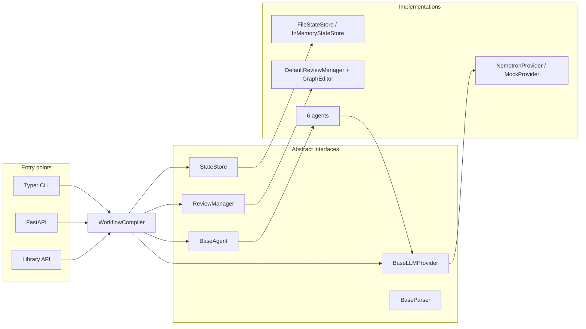
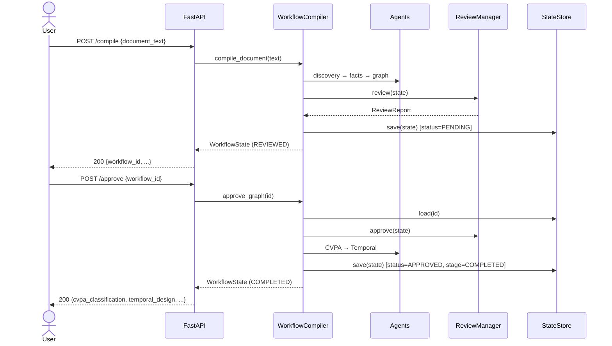

# Architecture

`workflow-compiler` turns a business document into canonical artifacts through a sequence of
single-responsibility **agents** orchestrated by `WorkflowCompiler`, with a human approval gate in
the middle. Every collaborator is defined by an abstract interface, so providers, parsers, the
review manager, and the state store are all swappable.

## Pipeline overview

```mermaid
flowchart TD
    doc["Business document<br/>(docx / pdf / md / html / txt)"]
    parser["DocumentParserFactory<br/>(ingestion)"]
    discovery["WorkflowDiscoveryAgent<br/>→ WorkflowMetadata"]
    facts["FactExtractionAgent<br/>→ WorkflowFacts"]
    graph["GraphBuilderAgent<br/>→ WorkflowGraph + Mermaid<br/>(deterministic, NetworkX)"]
    review["GraphReviewer / DefaultReviewManager<br/>→ ReviewReport"]
    gate{"Approval gate"}
    cvpa["CVPAClassifierAgent<br/>→ CVPAClassification"]
    temporal["TemporalGeneratorAgent<br/>→ TemporalWorkflowDesign"]
    done(["COMPLETED"])
    halt(["REJECTED — pipeline halts"])

    doc --> parser --> discovery --> facts --> graph --> review --> gate
    gate -->|approve| cvpa --> temporal --> done
    gate -->|reject| halt
```

LLM-backed stages: discovery, fact extraction, CVPA classification, Temporal design.
Deterministic (no LLM) stages: graph building, Mermaid rendering, structural review.

## Components



## Request sequence (compile → approve)



## State model

`WorkflowState` is the single aggregate threaded through the pipeline. Each stage populates one
field and advances `stage`:

| Stage                | Field populated          | Producer                  |
|----------------------|--------------------------|---------------------------|
| `METADATA_EXTRACTED` | `workflow_metadata`      | WorkflowDiscoveryAgent    |
| `FACTS_EXTRACTED`    | `workflow_facts`         | FactExtractionAgent       |
| `GRAPH_BUILT`        | `workflow_graph`, `mermaid_diagram` | GraphBuilderAgent |
| `REVIEWED`           | `review_report`          | DefaultReviewManager      |
| *(gate)*             | `approval_status`        | approve / reject          |
| `CLASSIFIED`         | `cvpa_classification`    | CVPAClassifierAgent       |
| `TEMPORAL_DESIGNED` → `COMPLETED` | `temporal_design` | TemporalGeneratorAgent |

`confidence_scores` accumulates a per-stage score throughout.

## Design principles

- **Provider-agnostic LLM layer.** Agents depend only on `BaseLLMProvider`; the concrete provider
  is injected. No vendor SDK is imported.
- **Deterministic where it matters.** Graph construction and structural review are pure functions
  of the extracted facts — reproducible and testable without a model.
- **Validated, immutable edits.** `GraphEditor` returns new validated `WorkflowGraph` instances;
  invalid edits raise rather than corrupting state.
- **Human-in-the-loop gate.** Downstream (CVPA, Temporal) artifacts are produced only after
  approval, keeping generated designs traceable to a reviewed graph.
- **Architecture, not code.** The Temporal stage emits specifications (names, parameters,
  policies) — never executable Temporal SDK code.
