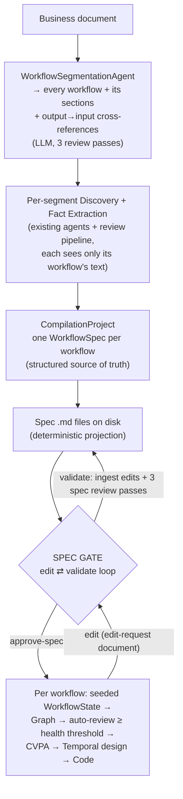
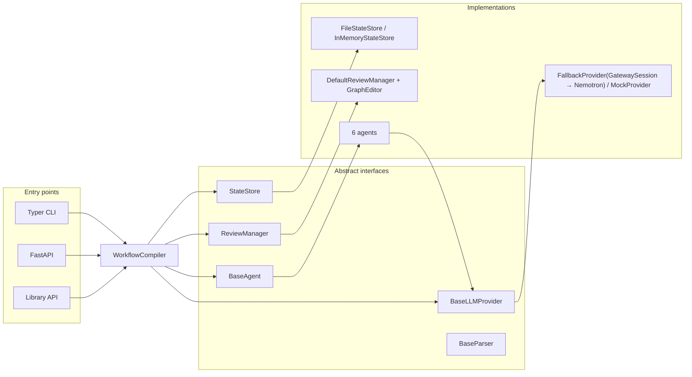
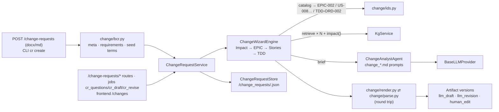
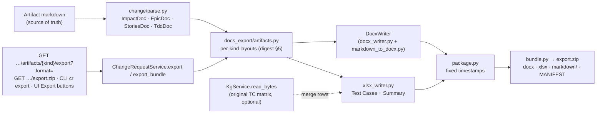
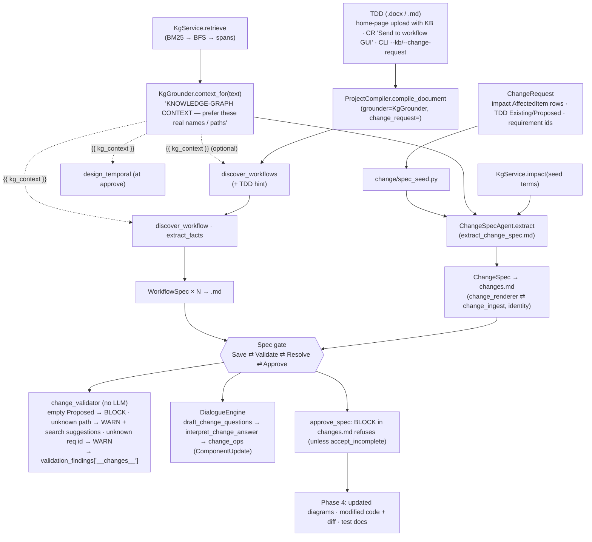
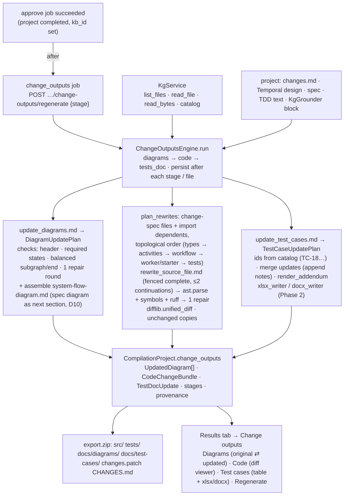
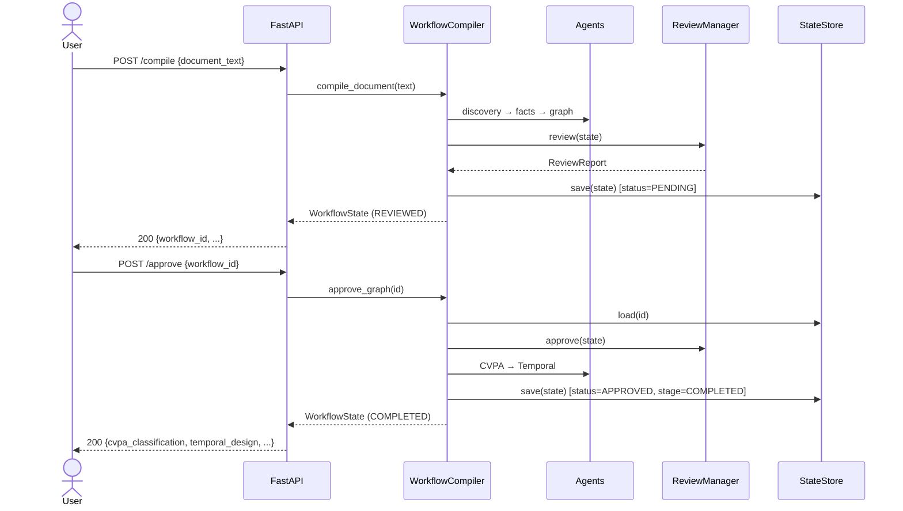

# Architecture

`workflow-compiler` turns a business document into canonical artifacts through a sequence of
single-responsibility **agents** orchestrated by `WorkflowCompiler`, with a human approval gate in
the middle. Every collaborator is defined by an abstract interface, so providers, parsers, the
review manager, and the state store are all swappable.

## Pipeline overview

```mermaid
flowchart TD
    doc["Business document<br/>(docx / pdf / md / html / txt)"]
    parser["DocumentParserFactory<br/>(ingestion)"]
    discovery["WorkflowDiscoveryAgent<br/>→ WorkflowMetadata"]
    facts["FactExtractionAgent<br/>→ WorkflowFacts + WorkflowStructure<br/>(flat facts + id-linked relations)"]
    checklist["Readiness checklist<br/>(deterministic; → spec Open Questions)"]
    graph["GraphBuilderAgent<br/>→ WorkflowGraph + Mermaid<br/>(deterministic, NetworkX)"]
    review["GraphReviewer / DefaultReviewManager<br/>→ ReviewReport"]
    gate{"Approval gate<br/>(automatic ≥ health threshold;<br/>approve / reject as manual override)"}
    cvpa["CVPAClassifierAgent<br/>→ CVPAClassification"]
    temporal["TemporalGeneratorAgent<br/>→ TemporalWorkflowDesign"]
    codegen["TemporalCodeGeneratorAgent<br/>→ TemporalCodeBundle<br/>(deterministic, Jinja2)"]
    done(["COMPLETED"])
    halt(["REJECTED — pipeline halts"])

    doc --> parser --> discovery --> facts --> checklist
    checklist --> graph --> review --> gate
    gate -->|approve| cvpa --> temporal --> codegen --> done
    gate -->|reject| halt
```

LLM-backed stages: discovery, fact extraction, CVPA classification, Temporal design.
Deterministic (no LLM) stages: graph building, Mermaid rendering, structural review,
**the readiness checklist** (`checklist/validator.py` + `amend.py`), and **Temporal code
generation**. The checklist never halts this engine pipeline: its uncleared items surface as the
spec's *Open Questions* (below), the user's answers fold back in as deterministic amendments (no
LLM re-run) at spec approval, and unmet *required* items become blocking findings there.

## Spec-centric front-end (ProjectCompiler)

For multi-workflow (or large, convoluted) documents, `ProjectCompiler` (`project_compiler.py`)
layers a **spec-centric front-end** on top of the unchanged per-workflow pipeline. The primary
human-reviewed artifact moves from the graph to a **workflow specification**:



Key invariants:

- **The structured model is the source of truth.** The Markdown spec is a pure render
  (`spec/renderer.py`); edits are parsed back **deterministically** (`spec/ingest.py`) and merged
  onto the existing model — never re-extracted by an LLM — so the compiled graph remains a pure
  function of what the human approved. A round-trip test asserts `ingest(render(spec)) == spec`.
- **Provenance-aware validation.** Every element carries provenance (`document_grounded` /
  `llm_inferred` / `human_provided`). The spec validator (`spec/validator.py`, three review passes
  re-targeted at the spec vs. the original document) may remove unsupported machine extractions
  but only ever *flags* human additions for confirmation. After every ingest,
  `WorkflowStructure.validated()` re-enforces referential integrity.
- **The checklist gate is absorbed.** Unmet readiness items render as the spec's *Open Questions*
  section; the user's answers fold back through the existing deterministic `checklist/amend.py`
  at approval time.
- **The graph gate becomes automatic.** Approval seeds one `WorkflowState` per spec (its
  `document_text` is the rendered spec — downstream prompts see the normalized artifact) and runs
  `WorkflowCompiler.compile_prepared`: graph review health ≥
  `WORKFLOW_COMPILER_GRAPH_HEALTH_THRESHOLD` (default 0.9) auto-approves; below it the workflow
  stays `PENDING` for the classic manual `approve`, and the project is marked `NEEDS_ATTENTION`.
- **Workflows compile independently**, but typed **output→input cross-references** between them
  are discovered, carried on the project, and must be user-confirmed (checkbox in the spec file)
  before approval unless explicitly overridden.
- **Cross-workflow triggers, not parent/child.** Executable relationships are
  `WorkflowTrigger`s (`models/spec.py`): source/target slugs, mode (`blocking` /
  `fire_and_forget`), an optional LLM-drafted human-confirmed `condition`, and a typed
  `input_map` that assembles the target's full `WorkflowInput` at start. Segmentation scaffolds
  them (explicit "A starts B" statements + data dependencies); they render in a **Triggers**
  spec section and round-trip through ingest. Temporal child workflows are deliberately avoided:
  every target stays a standalone workflow, started by name from a generated **activity**
  (workflow code may not call the client) with `id_conflict_policy=USE_EXISTING` for idempotent
  retries; blocking mode awaits `handle.result()` inside that activity. At approval,
  `_seed_state` copies the slug's outgoing triggers onto `WorkflowState.outgoing_triggers`,
  injects `TriggerNode`s into the structure (the graph shows `NodeType.TRIGGER` nodes), and the
  design agent deterministically folds them into the design as `TemporalTriggerDesign`
  declarations + plan `TRIGGER` steps (conditional → a `BRANCH` whose then-lane triggers).
- **Two-tier validation findings.** `validate_specs` produces structured `SpecFinding`s
  (`models/findings.py`): `BLOCKING` (unknown trigger target, undeclared input field,
  unisolated segment, unmet checklist) vs `WARNING` (type mismatch, unconfirmed predicate,
  missing result binding) vs `INFO` (ingest change log). `validate` exits non-zero on blocking;
  `approve_spec` refuses while blocking findings remain (`accept_incomplete` overrides).
- **Debug surface.** Every generated bundle exposes read-only queries (`current_step`,
  `decisions_taken`, `triggers_fired`) plus a `test_stepthrough.py` harness; the
  `WORKFLOW_COMPILER_STEPWISE` setting gates every top-level step behind an `advance` signal
  (`wait_condition` + signal — deterministic).

- **Edit requests re-enter the gate.** `ProjectCompiler.edit_specs` applies a human-authored
  **edit-request document** (`docs/EDIT_FORMAT_GUIDE.md`) to a compiled project. The skeleton is
  parsed deterministically (`spec/edit_ingest.py`, fail-fast before any LLM call); the
  natural-language entries are translated by `EditInterpreterAgent`
  (`agents/edit_interpreter.py`, prompt `interpret_edit_request.md`) into an `EditPlan`
  (`models/edit.py`) — the existing `Patch` vocabulary plus typed `TriggerOp`/`XrefOp` wiring
  operations. `EditPatchApplier` (`spec/edit_applier.py`) applies patches through
  `SpecPatchApplier(human_authority=True)`: adds need no document grounding and are marked
  `human_provided`; removals — including of human-provided or referenced elements — are honored
  (dangling references pruned by the integrity guard). The whole edit is **atomic** (applied to
  a deep copy; any failure leaves the stored project untouched); on success the edited specs'
  versions are patch-bumped, an `EditRecord` is appended to the project's append-only
  `edit_log`, and the project returns to `SPEC_DRAFTED` so validate → approve-spec re-runs.
  Whole workflows can be added (the section body runs through the normal discovery + facts
  pipeline and is appended to `document_text` for grounding) or removed (every trigger/xref
  touching the slug is dropped and logged). Split/merge syntax is reserved and rejected.

- **Preview → confirm (edit dry-run).** `ProjectCompiler.preview_edit` runs the same pipeline
  with nothing persisted and returns the would-be project, its `EditRecord`, and a
  `ResolvedEdit` blob (`models/edit.py`): the interpreted plans, drafted add-workflow specs,
  measured step timings, and a **fingerprint** over
  `(project_id, updated_at, sha256(document), workflow filter)`. Confirm =
  `edit_specs(resolved=...)`: the fingerprint and section sets are verified (mismatch →
  `EditPreviewStaleError`, HTTP 409 — any concurrent project change invalidates the preview)
  and the stored plans are replayed with **zero LLM calls**, so what was previewed is exactly
  what applies (interpretation nondeterminism cannot leak in between). The server stays
  stateless: the blob round-trips through the client; the deterministic applier still
  re-validates every operation against the current spec. Surfaces: the web UI's two-step
  Preview → Confirm dialog, `POST /projects/{id}/edit/preview`, and the CLI's `edit --dry-run`
  (which simply re-interprets on a real run — fine for a terminal flow).

- **Auth + ownership (HTTP surface only).** `api/auth.py`: local accounts (`models/user.py`,
  `storage/user_store.py` under `<state-root>/users/`), stdlib scrypt password hashing, and an
  HMAC-signed session cookie (secret from `WORKFLOW_COMPILER_SESSION_SECRET` or a generated
  `<state-root>/session_secret`). Every project/workflow route requires `get_current_user`;
  `CompilationProject.owner_id` is recorded for attribution; by default (`projects_shared`)
  every signed-in user sees and opens every project, and `WORKFLOW_COMPILER_PROJECTS_SHARED=false`
  restores per-owner scoping (listings filtered, 404 for other accounts' projects, unowned/CLI
  projects always visible). `author`/`reviewer` default to the signed-in
  user. The CLI bypasses auth by design — it drives the compiler directly, and filesystem
  access already implies full control.

- **Time-saved metric.** `ProjectCompiler` records each step's wall-clock seconds into
  `CompilationProject.stage_timings` (keys: `workflow-segmentation`, `extract:<slug>`,
  `validate:<slug>`, `edit:<slug>`, `compile:<slug>`; the preview's measured LLM seconds are
  carried in `ResolvedEdit.timings` so a confirm records real durations, not the ~0s replay).
  `metrics.py::compute_time_saved` — pure, deterministic, no LLM — compares them against the
  configurable `Settings.baseline_hours` estimates and powers `ProjectResponse.time_saved` and
  `GET /metrics/summary`. Baselines are labeled estimates everywhere; projects without recorded
  timings report `None` (no fabricated savings). Re-runs accumulate honestly — a human team
  re-validating would also re-spend the time.

Projects persist via `storage/project_store.py` (`<state-root>/projects/<id>.json`, same atomic
write pattern); per-workflow states are unchanged apart from an optional `project_id` back-link
and `outgoing_triggers`.

## Relational fact extraction → semantic graph wiring

Fact extraction emits two layers: **flat facts** (`WorkflowFacts`) and an optional
**relational `WorkflowStructure`** — entities that each carry a stable id, with every relation
(decision→activity, exception→activity, compensation→activity, event→emitter, parallel groups)
expressed by *referencing those ids*. `WorkflowStructure.validated()` enforces **referential
integrity**: any relation pointing at an id that was never declared is dropped (the anti-hallucination
guard), and **state transitions whose endpoints are actually entity ids** (the model leaking the step
flow into the state graph) are discarded so they can't build a junk subgraph. When a structure is
present, `GraphBuilderAgent` wires the graph *semantically* via
`WorkflowGraphBuilder.build_from_structure` — placing each edge from its explicit link, and routing
any uncompensated exception to a terminal so it can't dangle — instead of the positional `build`
fallback (which pairs the i-th activity with the i-th decision/exception/compensation and is only
used for legacy flat-only facts). This is what stops the graph from mis-attributing decisions,
events, and compensations.

The Temporal stage is two steps. `TemporalGeneratorAgent` (LLM) emits a
specification-only `TemporalWorkflowDesign` — names, parameters, policies, no code.
The design has two layers: **declarations** (activities, signals, queries, child
workflows, timers, compensations) and a typed **plan IR** — an ordered
control-and-data-flow graph of `TemporalStep` "action categories" (activity / child /
signal-gate / timer / parallel / branch) whose inputs are explicitly bound to the
workflow input or earlier step outputs. The design stage is fed the extracted
`workflow_facts` (retries, timeouts, compensations, I/O), so policies are *derived from*
the document rather than guessed. `TemporalCodeGeneratorAgent` (deterministic) then walks
that plan to render a runnable `TemporalCodeBundle` of Temporal Python SDK source files —
threading data between activities (capturing parallel-`gather` results positionally), firing
saga compensations in reverse on failure (with their inputs bound and retried, including
compensations for parallelized activities), and gating on signals. The LLM never writes code;
the code is a pure function of the reviewed, approved design. See `TEMPORAL_CODEGEN_FINDINGS.md`
for the standard it satisfies.

## Sequential review pipeline (default-on)

The default quality lever on the LLM stages where hallucinations originate (`discovery`, `facts`,
and segmentation). It follows a compiler-style discipline: **generate one canonical output, then
run three sequential review passes** — *completeness* (add elements explicitly in the document but
missing), *grounding* (remove/flag elements not supported by the document), *consistency* (merge
duplicates, rename to a canonical label, fix relations). Each pass emits **minimal deterministic
patches or `no_change`** (never a rewrite); a pure `PatchApplier` folds them in, dropping any
addition that duplicates an existing element or is not grounded in the document — which makes the
passes **idempotent** (re-running yields `no_change`). The facts applier re-runs
`WorkflowStructure.validated()` after each pass, so a patched relation can only point at a declared
entity. `ReviewPipelineAgent` wraps the stage's generator agent, configured by a `ReviewSpec`
(extract / serialize / apply + the three prompts + the applier) — an adapter shape, so a future
stage adds a spec, not engine code. On by default
(`--review` / `WORKFLOW_COMPILER_REVIEW_ENABLED`); the compiler's precedence is **review → plain**
per stage. It raises grounding/consistency, not certified truth — the human spec gate remains the
oracle, and per-pass provenance is recorded in `confidence_scores.notes`. Patch vocabulary lives in
`models/patch.py` (`PatchAction`, `Evidence`, `Patch`, `ReviewResult`); the engine, appliers, and
specs in `agents/review_pipeline.py`; the six prompts in `prompts/templates/review_*.md`.

## Components



## Knowledge bases (`kg/`, phase 0 of the change pipeline)

A zipped corpus becomes a Context Hub graph that later phases use to ground change requests and
specs. The vendored engine (`kg/contexthub`, pinned SHA) sits behind one typed façade.

```mermaid
flowchart LR
    upload["POST /knowledge-bases (zip)
CLI kb init"] --> ingest["kg/ingest.py
safe extract → corpus/"]
    ingest --> svc["KgService"]
    svc -->|"kb_ingest job (JobManager scope=knowledge_base)"| init["contexthub init_repo
static ingest"]
    init -->|"enrich (optional)"| bridge["ProviderJsonClient
(kg/llm_bridge)"]
    bridge --> prov["BaseLLMProvider
(nemotron | local | mock)"]
    init --> graph[".contexthub/graph.json"]
    svc -->|"retrieve / impact / search / files"| graph
    svc --> store["KnowledgeBaseStore
<state>/knowledge_bases/<id>.json"]
    api["/knowledge-bases/* routes
frontend /knowledge"] --> svc
```

Retrieval (`retrieve`) is BM25 anchor → bounded traversal → dereferenced file spans, returned as a
`KgPacket` whose `rendered` text is what later prompts get; `impact` is a deterministic BFS over
dependency edges. See `docs/HOW_IT_WORKS.md` §8c and `docs/kg-plan/`.

## Change requests (`change/`, phase 1 of the change pipeline)

A BCR plus a knowledge base goes through a deterministic four-step wizard; the model drafts,
the engine numbers, renders, versions and gates.



See `docs/HOW_IT_WORKS.md` §8d.

## Document export (`docs_export/`, phase 2 of the change pipeline)

Deterministic projection of the parsed artifacts to Word / Excel in the reference template style
(no LLM; identical input → identical bytes).



See `docs/HOW_IT_WORKS.md` §8e.

## KG-grounded projects + change spec (phase 3 of the change pipeline)

The approved TDD becomes an ordinary workflow project whose prompts are grounded in the knowledge
graph and which carries a second editable file, `changes.md`, through the same gate.



See `docs/HOW_IT_WORKS.md` §8f.

## Post-approval change outputs (phase 4 of the change pipeline)

After approval a grounded project produces the manager's three deliverables from the knowledge
base's real files; every stage is *LLM drafts, code decides* and persists on completion.



See `docs/HOW_IT_WORKS.md` §8g.

## Request sequence (compile → approve)



## State model

`WorkflowState` is the single aggregate threaded through the pipeline. Each stage populates one
field and advances `stage`:

| Stage                | Field populated          | Producer                  |
|----------------------|--------------------------|---------------------------|
| `METADATA_EXTRACTED` | `workflow_metadata`      | WorkflowDiscoveryAgent    |
| `FACTS_EXTRACTED`    | `workflow_facts`         | FactExtractionAgent       |
| `GRAPH_BUILT`        | `workflow_graph`, `mermaid_diagram` | GraphBuilderAgent |
| `REVIEWED`           | `review_report`          | DefaultReviewManager      |
| *(gate)*             | `approval_status`        | approve / reject          |
| `CLASSIFIED`         | `cvpa_classification`    | CVPAClassifierAgent       |
| `TEMPORAL_DESIGNED`  | `temporal_design`        | TemporalGeneratorAgent    |
| `CODE_GENERATED` → `COMPLETED` | `temporal_code` | TemporalCodeGeneratorAgent |

`confidence_scores` accumulates a per-stage score throughout.

## Design principles

- **Provider-agnostic LLM layer.** Agents depend only on `BaseLLMProvider`; the concrete provider
  is injected. No vendor SDK is imported. The default provider is the hosted `NemotronProvider`
  (NVIDIA cloud API); the opt-in `local` provider is a local eGPU gateway
  (`GatewaySessionProvider`, email+password session auth), and `local-fallback` composes the
  gateway as primary with Nemotron as automatic fallback on unreachable/timeout/5xx.
- **Deterministic where it matters.** Graph construction and structural review are pure functions
  of the extracted facts — reproducible and testable without a model.
- **Validated, immutable edits.** `GraphEditor` returns new validated `WorkflowGraph` instances;
  invalid edits raise rather than corrupting state.
- **Human-in-the-loop gate.** Downstream (CVPA, Temporal) artifacts are produced only after
  approval, keeping generated designs traceable to a reviewed spec.
- **Review over blind trust.** The sequential review pipeline patches each LLM stage's output by
  reference-free signals (evidence quotes, referential integrity, grounding); it suppresses
  hallucinations but never certifies truth — the spec gate stays the oracle.
- **The LLM specifies; templates emit code.** The LLM-backed Temporal stage emits
  specifications only (names, parameters, policies) — never executable code. Runnable Temporal
  Python SDK code is produced separately by a *deterministic* generator
  (`codegen/temporal`, Jinja2 templates) that renders the approved `TemporalWorkflowDesign`.
  Generated code is therefore a reproducible function of a reviewed design, and the no-code
  guarantee on the design model still holds.
