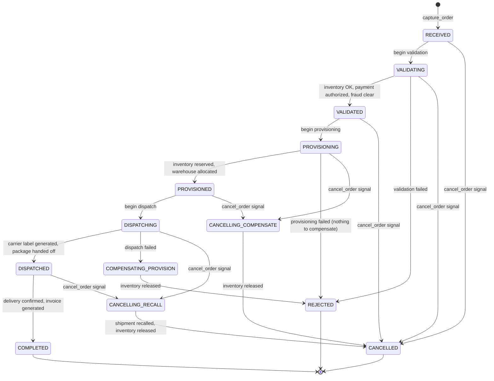
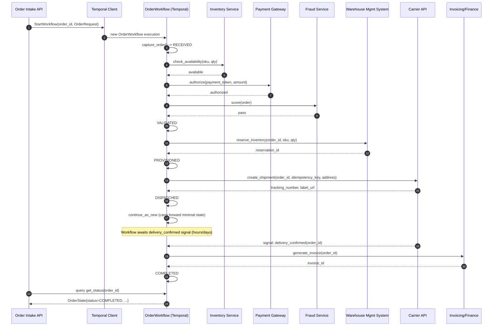
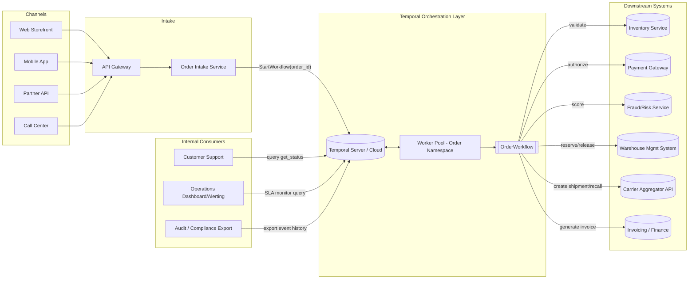

# System & Process Flow Diagrams — Order Lifecycle Workflow

Source `.mmd` files live in `docs/diagrams/mermaid/`. Rendered here for convenience (any Mermaid-aware viewer — GitHub, GitLab, most IDEs, or the Mermaid Live Editor — will render these directly).

## 1. Order State Machine

Governs every valid transition the `OrderWorkflow` can make. See TDD §4.1.

## 2. End-to-End Sequence (Happy Path)

Shows the calls the workflow makes to downstream systems and the delivery-confirmation signal wait. See TDD §4.7.

## 3. System Architecture

How the workflow orchestration layer sits between customer-facing channels and downstream enterprise systems. See TDD §3.

